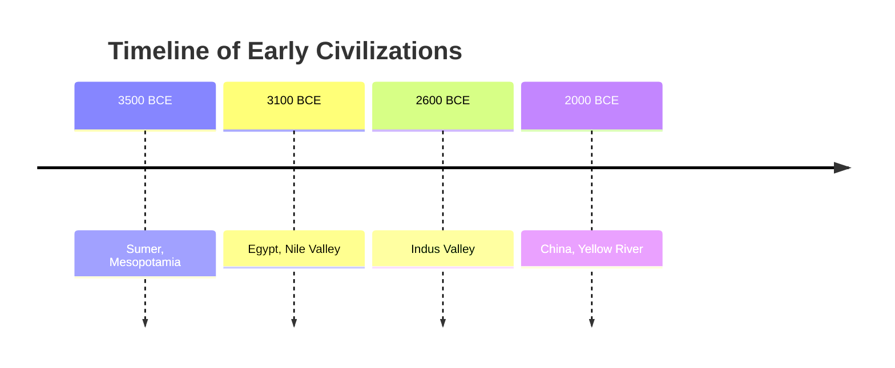
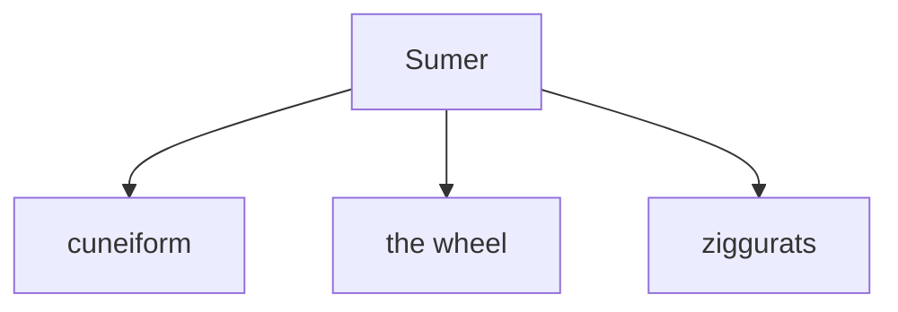
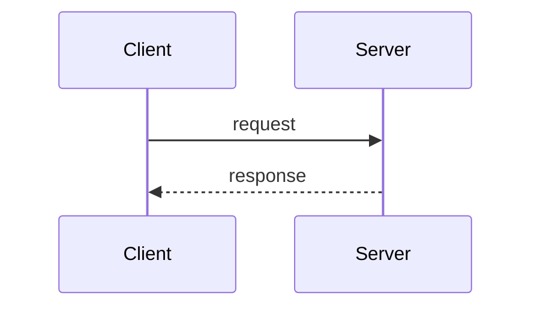
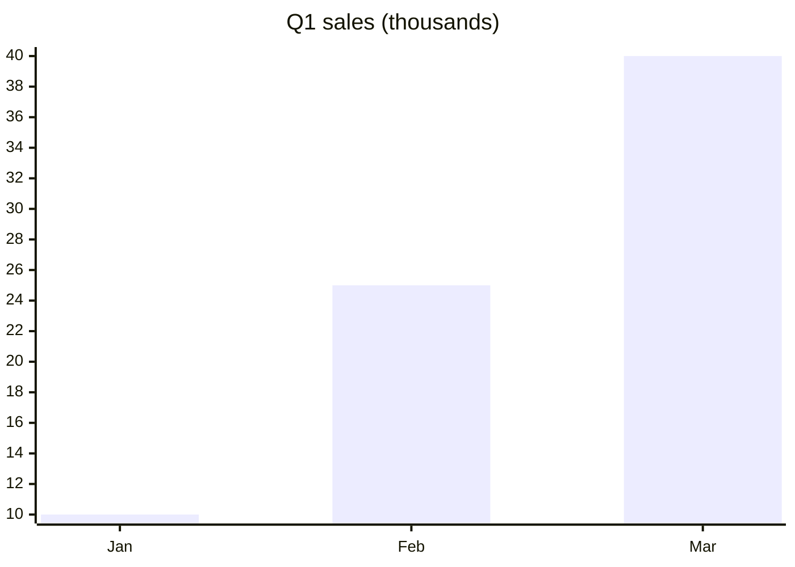

VISUAL GUIDE — mermaid (structure, time & sequence)

Use a ` ```mermaid ` fenced block for **structural / temporal** diagrams. The
server renders the source to SVG. Embed the fence inside the markdown you pass
to `mount_template`/`edit_note`.

## Pick the diagram type by the SHAPE of the data

- **Chronology** — dated events, eras, "a timeline of …", anything in time
  order → `timeline`
- **Process / steps / decision flow / hierarchy** → `flowchart` (`graph TD`/`LR`)
- **Interactions between actors over time** → `sequenceDiagram`
- **Comparing MAGNITUDES** across a few categories (sales, counts, scores)
  → `xychart-beta` bars

A date or year is a **position in time, not a magnitude** — never plot years as
bar heights. "Timeline" almost always means `timeline`, not a bar chart.

## timeline — chronological events



Each `<period> : <event>` row places an event in time order. Chain more events
on one period with `: event : event`.

## flowchart — steps, pipelines, trees



## sequenceDiagram — interactions over time



## xychart-beta — comparing magnitudes (NOT dates)



Rules:
- Wrap any node label containing parens, punctuation, or `<br/>` in double
  quotes — `A["f(x) = x²"]` — or the parser rejects it.
- mermaid is for STRUCTURE / TIME / SEQUENCE. For a CONTINUOUS numeric
  relationship — function curves, regression lines, scatter, data-and-fit
  pictures, 3D surfaces — do NOT use mermaid; open the `plot` guide instead
  (`load_guide(['plot'])`).
